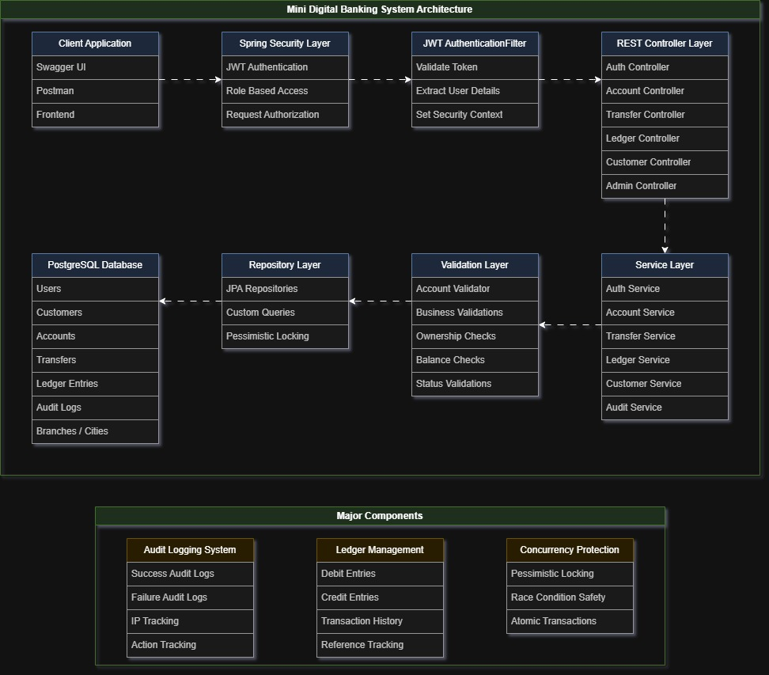
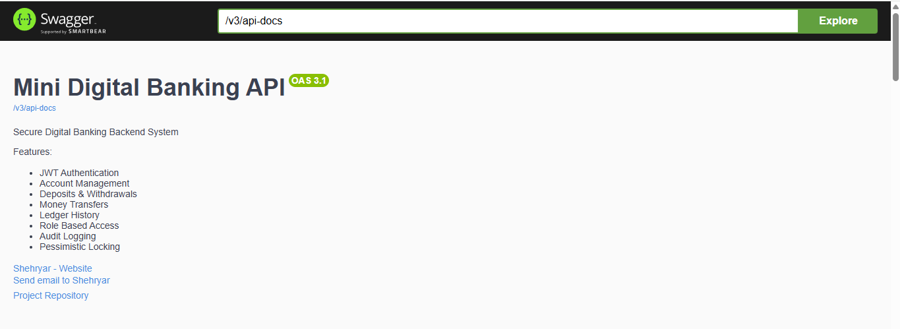
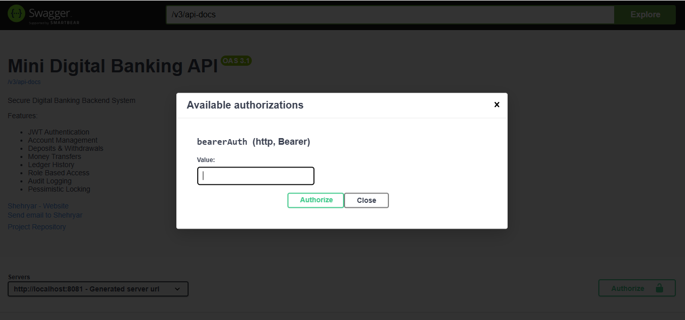
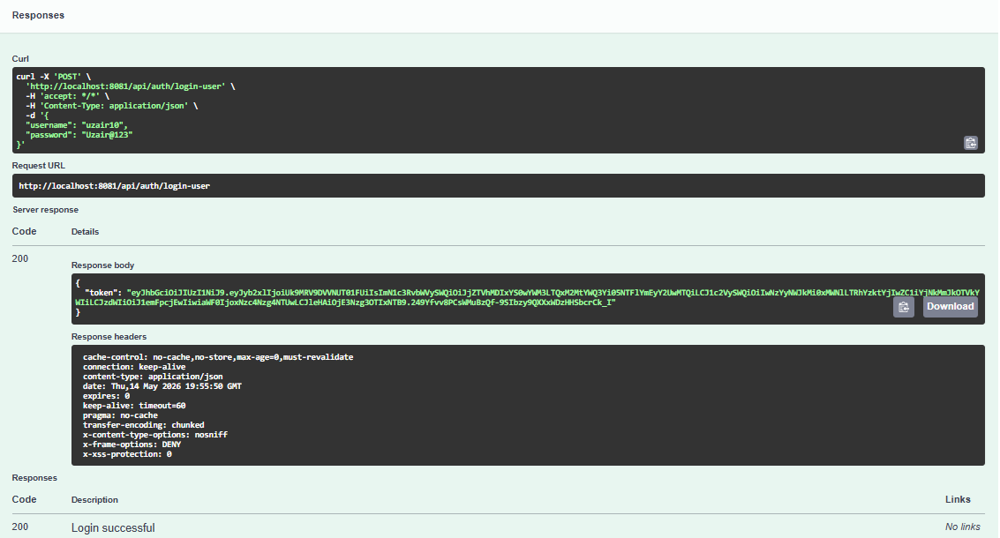
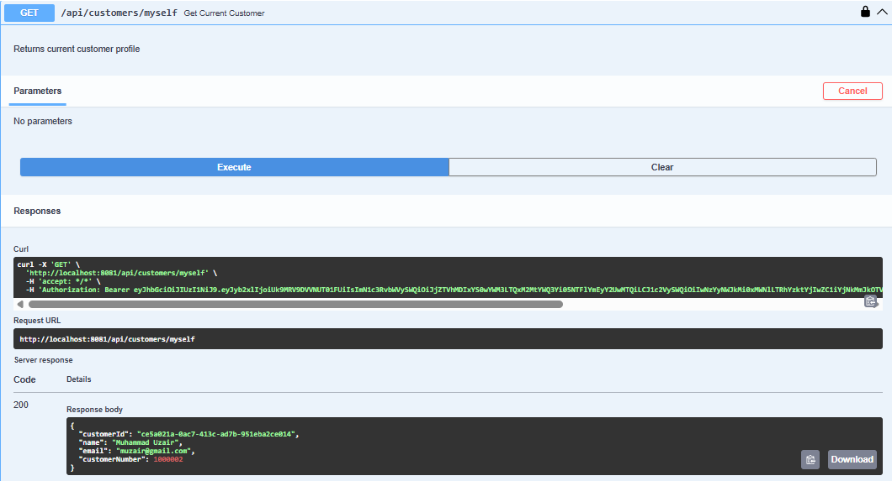
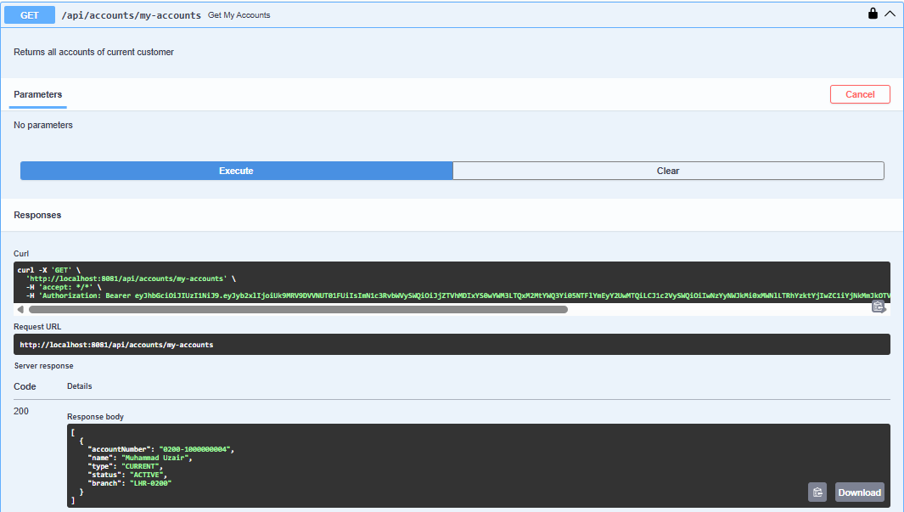
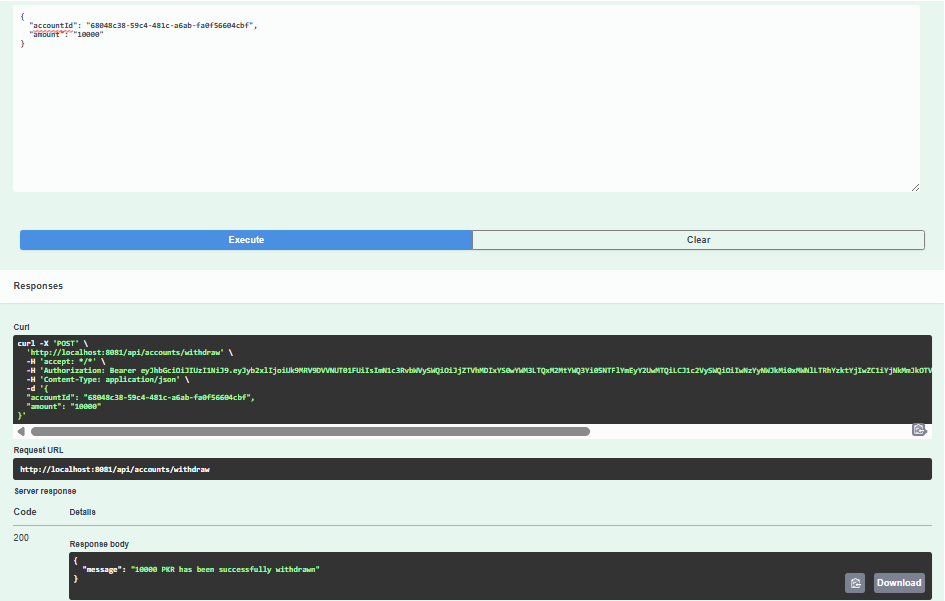
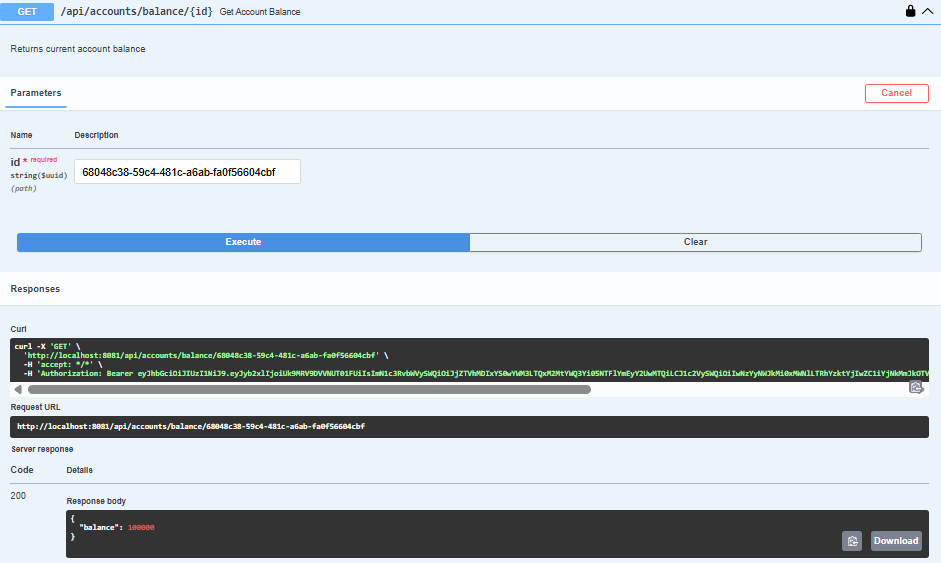
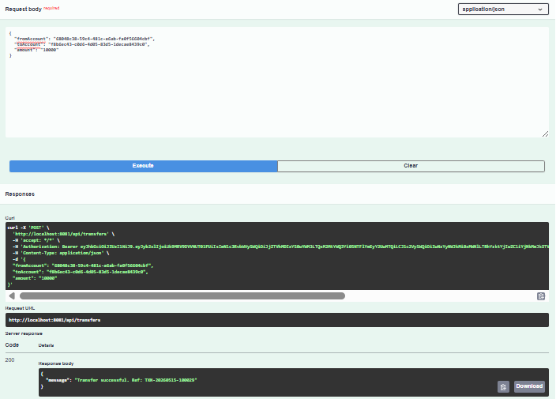
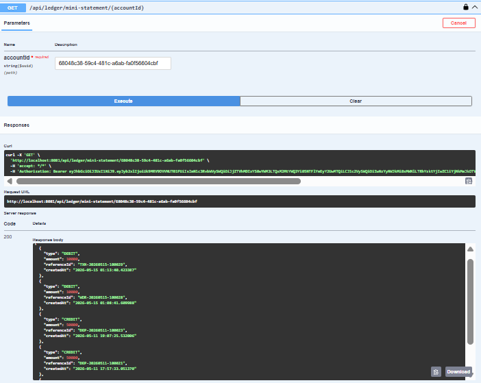

# Mini Digital Banking System

Production-style backend banking system built using Spring Boot.

Features include:
- JWT Authentication
- Account Management
- Customer Management
- Secure Transfers
- Ledger History
- Audit Logging
- Role-based Authorization
- Flyway Database Migration
- Concurrency-safe transfers

---

# Tech Stack

- Java 21
- Spring Boot
- Spring Security
- JWT
- PostgreSQL
- Flyway
- Maven
- Hibernate / JPA

---

# Architecture

Modular architecture:

- Auth Module
- Account Module
- Transfer Module
- Ledger Module
- Audit Module
- Customer Module

## System Architecture



---

# Features

## Authentication
- User Registration
- JWT Login
- Password Change
- Role-based Authorization

## Accounts
- Create Account
- Deposit
- Withdraw
- Balance Inquiry
- Account Status Update

## Transfers
- Account-to-Account Transfers
- Pessimistic Locking
- Reference ID Generation
- Concurrency-safe Transactions

## Ledger
- Transaction History
- Ordered Ledger Entries
- Mini Statement

## Audit
- Success/Failure Audit Logs
- IP Tracking
- User Action Tracking

---

# Security Features

- JWT Authentication
- BCrypt Password Encryption
- Role-based Access Control
- Ownership Validation
- Concurrency-safe Transfers
- Pessimistic Row Locking

---

# Concurrency Handling

This project implements pessimistic row-level locking to prevent race conditions during concurrent money transfers.

Features:
- Atomic transactions
- Row-level database locking
- Concurrency-safe balance updates
- Transfer consistency protection

---

# Database Migration

Flyway is used for version-controlled database migrations.

Migration includes:
- Tables
- Constraints
- Sequences
- Foreign Keys
- Initial schema setup

---

# Transaction Reference IDs

Production-style reference IDs are generated for financial operations.

Examples:
- TXN-20260507-100006
- DEP-20260507-100005
- WDL-20260507-100004

---

# APIs

| Method | Endpoint | Description | Module |
|---|---|---|---|
| POST | /api/auth/register-user | Register User | Auth |
| POST | /api/auth/login-user | Login User | Auth |
| GET | /api/users/myself | Get Current User | Auth |
| PUT | /api/users/change-password | Change Password | Auth |
| GET | /api/customers/myself | Get Current Customer | Customer |
| PUT | /api/customers/update | Update Customer | Customer |
| POST | /api/accounts | Create Account | Account |
| GET | /api/accounts/my-accounts | Get My Accounts | Account |
| GET | /api/accounts/{id} | Get Account By ID | Account |
| GET | /api/accounts/number/{accountNumber} | Get Account By Number | Account |
| POST | /api/accounts/deposit | Deposit Amount | Account |
| POST | /api/accounts/withdraw | Withdraw Amount | Account |
| GET | /api/accounts/balance/{accountId} | Balance Inquiry | Account |
| PUT | /api/accounts/status/{accountId} | Update Account Status | Account |
| POST | /api/transfers | Account-to-Account Transfer | Transfer |
| GET | /api/transfers/{txnId} | Get Transfer Details | Transfer |
| GET | /api/ledger/mini-statement/{accountId} | Mini Statement | Ledger |

---

# Swagger API Documentation

## Swagger Home


## JWT Authorization


## User Login


## Get Customer


## Get Accounts


## Account Withdraw


## Get Account Balance


## Account Transfer


## Ledger History


---

# Run Project

```bash
git clone <repo-url>
cd mini-bank
mvn clean install
mvn spring-boot:run